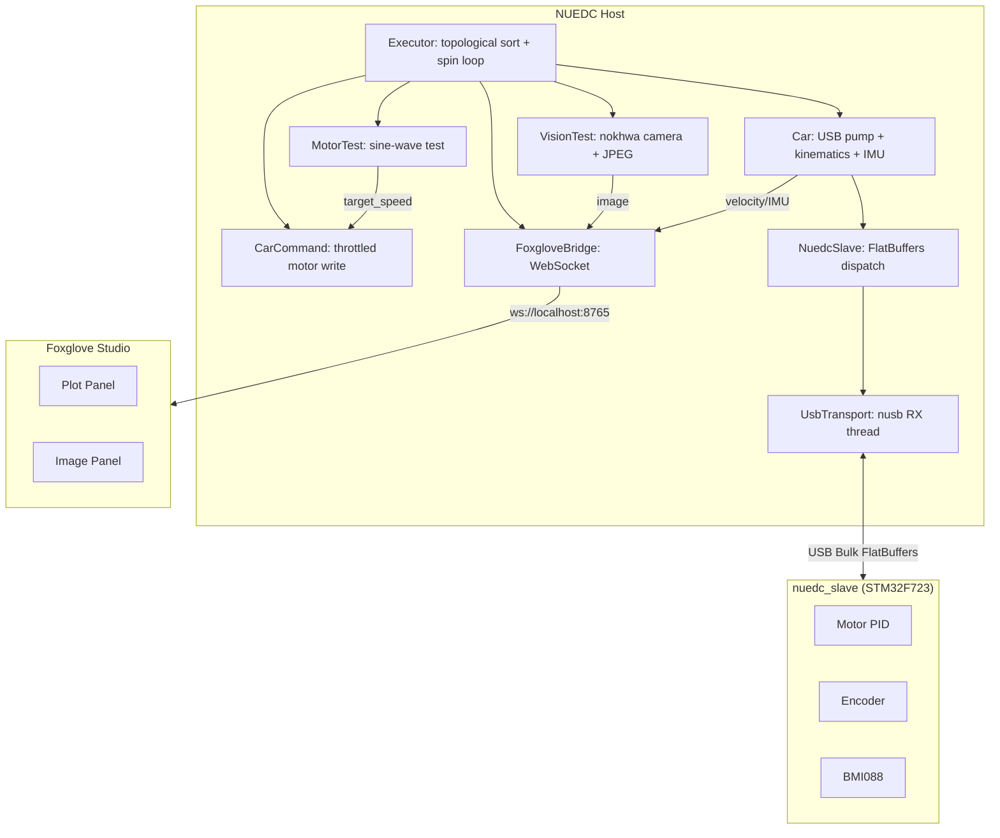

# NUEDC

嵌入式机器人竞赛开发项目。主机端（x86_64 / aarch64）通过 USB Bulk 与下位机通信（FlatBuffers 协议），内置 Foxglove WebSocket 桥接实时可视化。

**双语言实现：C++26 和 Rust，共享同一套 config.yaml。**

## 架构



## 快速开始

### 环境

- **C++**: GCC 16+ (C++26 `-freflection`), CMake 3.22+, Ninja, vcpkg
- **Rust**: nightly 1.85+ (`flatc` for schema codegen)

### 编译运行

```bash
# C++ 本机
cmake --preset native && cmake --build build
cmake --install build --prefix ./build/install && ./build/install/bin/main

# Rust 本机
cmake --preset rust-native && cmake --build build
cmake --install build --prefix ./build/install && ./build/install/bin/main

# C++ aarch64 交叉编译
cmake --preset aarch64-static && cmake --build build
cmake --install build --prefix ./build/install

# Rust aarch64 交叉编译（纯 Rust，无 C/C++ 依赖）
cmake --preset rust-aarch64 && cmake --build build
cmake --install build --prefix ./build/install --component runtime

# 部署到目标板
scp -r build/install/* board:/opt/nuedc/
ssh board /opt/nuedc/bin/run.sh
```

### 预设一览

| Preset | 语言 | 架构 | 说明 |
|--------|------|------|------|
| `native` | C++ | x86_64 | 动态链接 |
| `native-static` | C++ | x86_64 | 静态链接 |
| `aarch64-static` | C++ | aarch64 | 交叉编译 + runtime bundle |
| `rust-native` | Rust | x86_64 | 纯 Rust，0.2s configure |
| `rust-aarch64` | Rust | aarch64 | 纯 Rust，交叉编译友好 |

### Foxglove 实时可视化

1. 启动程序 → 打开 [Foxglove Studio](https://foxglove.dev/)
2. 连接 → "Foxglove WebSocket" → `ws://localhost:8765`
3. 左侧 channels 面板勾选数据源，拖入 Plot / Image 面板

config.yaml 配置：

```yaml
foxglove:
  host: "0.0.0.0"
  port: 8765
  channels:
    /chassis/velocity: { type: double, hz: 50 }
    /imu/gyro_z:       { type: double, hz: 100 }
    /vision/image:     { type: image,  hz: 30 }
```

支持类型：`float` `double` `int`（Plot 面板）`image`（Image 面板，JPEG → CompressedImage）。

## 项目结构

```
NUEDC/
├── include/                    # C++ 头文件
│   ├── core/                   # Component / Executor / Config
│   ├── controller/             # PID / Chassis / Kalman
│   ├── devices/                # EncoderMotor / CanMotor / Bmi088
│   ├── hardware/               # Car + CarCommand
│   ├── usb/                    # UsbTransport / NuedcSlave / Protocol
│   ├── vision/                 # VisionTest (OpenCV)
│   ├── util/                   # RingBuffer / Throttle / FoxgloveBridge
│   ├── test/                   # MotorTest
│   └── fast_tf/                # Compile-time TF tree
├── src/                        # C++ 源文件
├── schemas/                    # FlatBuffers .fbs (与固件共享)
├── config/                     # config.yaml
├── ports/                      # vcpkg ports (foxglove-sdk)
├── toolchains/ triplets/       # CMake 工具链
├── rust/                       # Rust 实现
│   ├── build.rs                # flatc → Rust codegen
│   ├── .cargo/config.toml      # 交叉编译配置 + LTO
│   └── src/
│       ├── main.rs             # 入口（YAML → registry → Executor）
│       ├── core/               # component / executor / config
│       ├── controller/         # PID / ChassisIk / KalmanFilter
│       ├── devices/            # EncoderMotor / CanMotor / Bmi088 Mahony
│       ├── hardware/           # Car + CarCommand + Handler impl
│       ├── usb/                # nusb transport / NuedcSlave / framing
│       ├── util/               # foxglove_bridge / ring_buffer / throttle
│       ├── vision/             # VisionTest (nokhwa + image)
│       ├── test/               # MotorTest
│       └── registry.rs         # inventory 自动注册
├── CMakeLists.txt
├── CMakePresets.json
└── vcpkg.json
```

## 组件系统

### C++（反射）

C++26 `-freflection` 自动发现组件，无需宏：

```cpp
namespace nuedcs::my_namespace {
class MyComponent : public core::Component {
    MyComponent(ryml::NodeRef config) { /* ... */ }
    void update() override { /* ... */ }
};
}
```

```cpp
// main.cpp — 只需一行命名空间枚举
nuedcs::core::register_namespace_components<^^nuedcs::my_namespace>();
```

### Rust（inventory 自动注册）

组件文件末尾加一行 `register_component!`，`inventory` crate 在链接期收集：

```rust
impl Component for MyComponent { /* ... */ }

register_component!(MyComponent::from_yaml, "nuedcs::my::MyComponent");
```

`main.rs` 不写 match 分支，新组件零侵入：

```rust
let comp = registry::create_component(type_name, instance_name, config)?;
exec.add(comp);
```

## 依赖对比

| | C++（静态链接） | Rust |
|------|---------|------|
| 序列化 | flatbuffers C++ | flatbuffers Rust |
| YAML | ryml | serde_yaml |
| 日志 | spdlog | log + env_logger |
| 数学 | Eigen3 | nalgebra |
| 摄像头 | OpenCV (C++) | **nokhwa** + **image** (纯 Rust) |
| USB | libusb (C) | **nusb** (纯 Rust) |
| WebSocket | foxglove-sdk (Rust→C) | foxglove (纯 Rust) |
| 编译发现 | `-freflection`（编译器内置） | **inventory** (链接期收集) |
| 产物大小 | 16 MB | **3.6 MB** |

Rust 版全依赖纯 Rust，x86_64 和 aarch64 交叉编译只需一行 `--target`，无 pkg-config / vcpkg 特殊处理。

## 线程模型

```
USB bg thread                    main thread (spin loop)
    │                                │
    ├─ nusb read_bulk(1ms) ──► rx_ring (SPSC)
    ├─ 0x5A decode                                  │
    │                                ├─ slave.pump() → dispatch
    │                                ├─ devices update_status
    │                                ├─ kinematics + AHRS
    │                                └─ FoxgloveBridge log
    │                                │
    ├─◄── tx_ring (SPSC) ◄── command_update (throttled)
```

全 lock-free：`RingBuffer` (SPSC) + `AtomicBool`，零 mutex。

## 设备驱动

```
store_xxx(raw)  ──►  update_status()  ──►  generate_command()
(USB 回调)          (主循环)               (主循环, throttled)
 atomic/ring push   load → convert         read Input → raw cmd
```

- **Bmi088** — ring-buffered, drain all samples through Mahony AHRS
- **EncoderMotor** — firmware-computed velocity, atomic store
- **CanMotor** — NaN priority: angle > velocity > torque, DJI + LK protocol

## License

MIT
