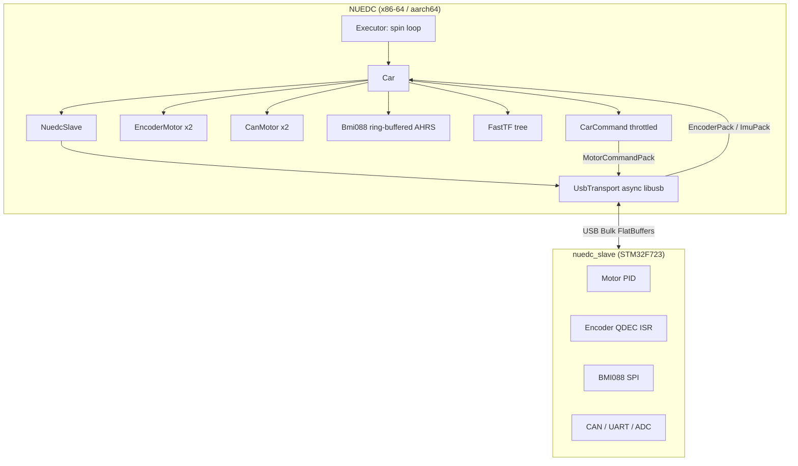
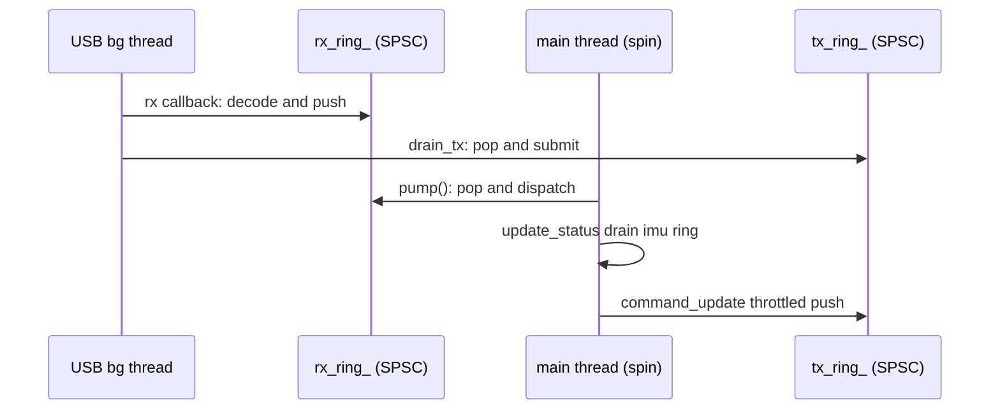
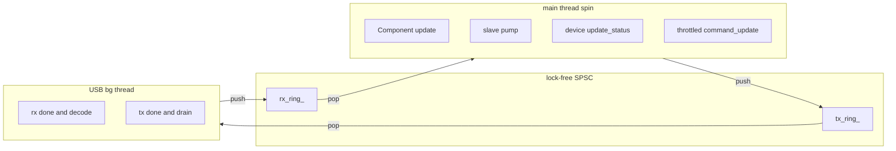

# NUEDC

嵌入式机器人竞赛开发项目。主机端（x86-64 / aarch64）通过 USB Bulk 与下位机（STM32F723 Zephyr）通信，FlatBuffers 协议。

## 架构



### 数据流



## 快速开始

### 预设一览

| Preset | 编译器 | 链接 | 用途 |
|--------|--------|------|------|
| `native` | GCC 16 | 动态 | 本机开发 |
| `native-static` | GCC 16 | 静态 | 本机单文件发布 |
| `native-debug` | GCC 16 | 动态, -O0 | 本机调试 |
| `clang` | Clang 22 | 动态 | Clang 开发 |
| `clang-static` | Clang 22 | 静态 | Clang 发布 |
| `clang-debug` | Clang 22 | 动态, -O0 | Clang 调试 |
| `aarch64` | GCC cross | 动态 | ARM64 部署 |
| `aarch64-static` | GCC cross | 静态 | ARM64 自包含 |

### 本机开发

```bash
cmake --preset native && cmake --build build
cmake --install build --prefix ./build/install && ./build/install/bin/main
```

### 交叉编译 aarch64

```bash
cmake --preset aarch64 && cmake --build build
cmake --install build --prefix ./build/install

scp -r build/install/* board:/opt/nuedc/
ssh board /opt/nuedc/bin/main
```

## 项目结构

```
NUEDC/
├── include/
│   ├── core/
│   │   ├── component.hpp              # Component 基类 + Input/OutputInterface + Config
│   │   ├── component_registry.hpp     # 自动注册工厂
│   │   └── executor.hpp               # 拓扑排序 + spin-loop
│   ├── controller/
│   │   ├── pid/                       # PID 
│   │   └── chassis/                   # 二轮差速解算
│   ├── devices/
│   │   ├── encoder_motor.hpp          # 固件端电机
│   │   ├── can_motor.hpp              # CAN 直通电机
│   │   └── bmi088.hpp                # IMU + Mahony AHRS (ring-buffered)
│   ├── hardware/
│   │   └── car.hpp                    # 差分底盘
│   ├── usb/
│   │   ├── protocol.hpp               # 帧协议 0x5A|size(4)|body|0xA5
│   │   ├── usb_transport.hpp          # 异步 libusb + SPSC ring
│   │   └── nuedc_slave.hpp            # NuedcSlave<Handler> 协议层
│   ├── fast_tf/                       # FastTF (GPL-3.0) 编译期 TF 树
│   └── util/
│       ├── ring_buffer.hpp            # 无锁 SPSC ring buffer
│       └── throttle.hpp              # 自限频工具
├── schemas/                           # FlatBuffers schema (与固件共享)
├── config/
│   └── config.yaml
├── toolchains/                        # GCC / Clang 工具链
├── triplets/                          # vcpkg 三元组 (GCC/Clang, 动静)
├── CMakePresets.json
├── CMakeLists.txt
└── vcpkg.json
```

## 组件系统

### 写一个组件

```cpp
#include "core/component_registry.hpp"

class MyComponent : public core::Component {
public:
    MyComponent(ryml::NodeRef config) {
        auto c = core::Config{config};
        threshold_ = c["threshold"].get(0.5);
        register_output("/" + name() + "/value", out_, 0.0);
    }
    void update() override { *out_ = compute(); }
private:
    OutputInterface<double> out_;
    double threshold_;
};
REGISTER_COMPONENT(nuedcs::components, MyComponent);
```

### 配置访问

```cpp
auto c = core::Config{config};           // thin wrapper over ryml
auto v  = c["key"].get<double>(3.14);    // warns if key missing
auto s  = c["path"]["to"]["key"].str();  // nested, warns at each missing level
```

### Partner 组件

```cpp
class Car : public core::Component {
    Car(ryml::NodeRef config)
        : command_(create_partner_component<CarCommand>(name() + "_command", *this)) {
        register_output(name() + "/_car_sync", sync_out_, true);  // explicit dependency
    }
private:
    class CarCommand : public core::Component {
        void update() override { car_.command_update(); }
        Car& car_;
        InputInterface<bool> sync_in_;
    };
    CarCommand* command_;
};
REGISTER_COMPONENT(nuedcs::hardware, Car);
```

## 设备驱动


```
store_xxx(raw)  ──►  update_status()  ──►  generate_command()
(USB 回调)          (主循环)               (主循环, throttled)
 atomic/ring push   load → convert         read InputInterface → raw cmd
```

```cpp
// Bmi088 — ring-buffered, 不漏数据
imu_.store_sample(ax, ay, az, gx, gy, gz);  // USB 回调
imu_.update_status();                        // 主循环 drain ring → AHRS

// EncoderMotor — 固件已算好速度
enc.store_velocity(12.5f);                   // USB 回调, 直接存
enc.update_status();                         // publish output

// CanMotor — NaN 优先级 angle > velocity > torque
motor.store_status(can_8bytes);
motor.update_status();
uint64_t cmd = motor.generate_command();
```

## 线程模型



全 lock-free：`RingBuffer` (SPSC) + `std::atomic`，零 mutex。
